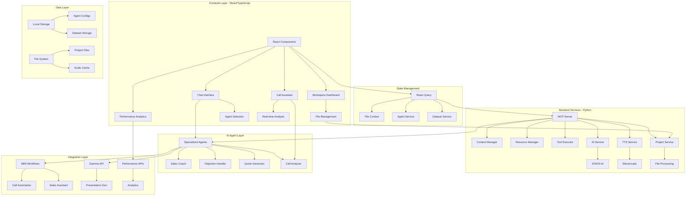

# 🤖 Sensei AI - Advanced Sales Intelligence Platform

A comprehensive AI-powered sales coaching and intelligence platform that combines real-time conversation analysis, specialized AI agents, and automated workflow integration to transform sales performance.

## 🏗️ Architecture Overview

Sensei AI is built on a hybrid architecture combining React frontend with Python backend services, integrated through MCP (Model Context Protocol) for seamless AI agent management.



## 🚀 Quick Start

### Prerequisites
- Node.js 18+ and npm/yarn
- Python 3.8+
- Modern browser with WebRTC support

### Frontend Setup
```bash
# Install dependencies
npm install

# Start development server
npm run dev

# Build for production
npm run build
```

### Backend Setup
```bash
# Install Python dependencies
pip install -r requirements.txt

# Set up environment variables
cp .env.example .env
# Edit .env with your API keys

# Start the Python backend
python app.py
```

### Environment Configuration
```env
OPENAI_API_KEY=your_openai_key
ELEVENLABS_API_KEY=your_elevenlabs_key
GAMMA_API_KEY=your_gamma_key
IONOS_API_TOKEN=your_ionos_token
```

## 🧩 Core Components

### Frontend Architecture (React/TypeScript)

#### 1. **Workspace Dashboard** (`src/pages/Workspace.tsx`)
- Central hub with tabbed interface
- File management and context switching
- Agent and dataset selection
- Performance monitoring

#### 2. **Chat Interface** (`src/components/Chat.tsx`)
- Multi-agent conversation system
- Message threading and history
- Export functionality
- Context-aware responses

#### 3. **Call Assistant** (`src/components/CallAssistant.tsx`)
- Real-time call transcription
- Live AI coaching suggestions
- Objection detection and responses
- Performance tracking

#### 4. **AI Intelligence Suite**
- **Enhanced Call Intelligence** (`src/components/EnhancedCallIntelligence.tsx`)
- **Objection Handler** (`src/components/ObjectionHandler.tsx`)
- **Quote Generator** (`src/components/QuoteGenerator.tsx`)
- **Performance Dashboard** (`src/components/PerformanceDashboard.tsx`)

#### 5. **Integration Components**
- **Gamma Integration** (`src/components/GammaIntegration.tsx`)
- **File Management** (`src/components/FileUpload.tsx`, `src/components/FilesPanel.tsx`)
- **Agent Configuration** (Agent and Dataset management)

### Backend Services (Python)

#### 1. **MCP Server** (`mcp/server.py`)
- Resource and tool registration
- Context management
- Tool execution with logging
- Server lifecycle management

#### 2. **AI Service** (`services/ai_service.py`)
- IONOS AI API integration
- Script improvement and generation
- Quick action functions
- Context-aware responses

#### 3. **TTS Service** (`services/tts_service.py`)
- ElevenLabs text-to-speech
- Audio generation and caching
- Voice customization
- Real-time audio streaming

#### 4. **Project Service** (`services/project_service.py`)
- File processing and storage
- Project data management
- Context extraction
- Metadata handling

### Specialized AI Agents (`src/services/specializedAgents.ts`)

#### Sales Coach Agent
- Conversation flow optimization
- Closing technique suggestions
- Performance improvement tips
- Personalized coaching insights

#### Objection Handler Agent
- Real-time objection detection
- Response strategy generation
- Competitive positioning
- Confidence building scripts

#### Quote Generator Agent
- Dynamic pricing calculations
- Proposal automation
- ROI analysis integration
- Customizable templates

#### Call Analyzer Agent
- Sentiment analysis
- Talk-time ratios
- Key moment identification
- Action item extraction

## 🔗 API Integrations

### IONOS AI Integration
- Primary AI processing engine
- Context-aware responses
- Multi-model support
- Real-time streaming

### ElevenLabs TTS
- High-quality voice synthesis
- Custom voice cloning
- Real-time audio generation
- Multiple language support

### Gamma API
- Automated presentation generation
- Data visualization
- Template customization
- Export capabilities

### N8N Workflows
- Call automation pipelines
- CRM integrations
- Lead scoring automation
- Follow-up sequences

## 📊 Data Management

### File Context System (`src/contexts/FileContext.tsx`)
- Centralized file state management
- Context extraction and indexing
- Search and filtering capabilities
- Real-time updates

### Agent Configuration (`src/services/agentService.ts`)
- Dynamic agent creation
- Parameter customization
- Performance tracking
- Version management

### Dataset Management (`src/services/datasetService.ts`)
- Knowledge base organization
- Chunk-based processing
- Relevance scoring
- Context retrieval

## 🎯 Usage Guide

### For Sales Representatives

#### 1. **Setup Your Workspace**
- Upload sales materials, scripts, and product docs
- Configure your preferred AI agents
- Set up call recording integration

#### 2. **During Calls**
- Activate Call Assistant for real-time coaching
- View objection handling suggestions
- Generate quotes on-demand
- Track performance metrics

#### 3. **Post-Call Analysis**
- Review conversation analytics
- Export call summaries
- Update CRM with AI insights
- Plan follow-up actions

### For Sales Managers

#### 1. **Team Performance Monitoring**
- Access Performance Dashboard
- Review team metrics and trends
- Identify coaching opportunities
- Generate executive reports

#### 2. **Agent Configuration**
- Customize AI agents for team needs
- Upload training materials
- Configure workflow automations
- Monitor system usage

#### 3. **Integration Management**
- Connect CRM systems via N8N
- Set up automated reporting
- Configure Gamma presentations
- Manage API keys and access

## 🛠️ Development

### Project Structure
```
├── src/                     # React frontend
│   ├── components/         # UI components
│   ├── pages/             # Route components
│   ├── services/          # API services
│   ├── hooks/             # Custom hooks
│   ├── contexts/          # React contexts
│   └── types/             # TypeScript definitions
├── mcp/                    # MCP server implementation
├── services/              # Python backend services
├── n8n-workflows/         # Automation workflows
└── ui/                    # Python UI components
```

### Key Technologies
- **Frontend**: React 18, TypeScript, Tailwind CSS, Vite
- **Backend**: Python, Gradio, MCP Protocol
- **AI**: IONOS AI, OpenAI, ElevenLabs
- **State Management**: React Query, Context API
- **UI Components**: Radix UI, shadcn/ui
- **Automation**: N8N workflows

### Development Guidelines

#### Component Creation
- Use functional components with hooks
- Implement proper TypeScript typing
- Follow design system tokens
- Create focused, reusable components

#### API Integration
- Use React Query for data fetching
- Implement proper error handling
- Add loading states and fallbacks
- Cache responses appropriately

#### State Management
- Use React Context for global state
- Implement proper cleanup in useEffect
- Optimize re-renders with useMemo/useCallback
- Follow immutable update patterns

## 🚀 Deployment

### Production Build
```bash
# Frontend
npm run build
npm run preview

# Backend
python app.py --share
```

### Environment Setup
- Configure API keys in production environment
- Set up proper CORS policies
- Enable SSL/TLS for secure connections
- Configure logging and monitoring

### Scaling Considerations
- Implement Redis for session storage
- Add database for persistent data
- Set up load balancing for high traffic
- Monitor API rate limits and costs

## 🔧 Troubleshooting

### Common Issues

#### Frontend
- **Build failures**: Check TypeScript errors and dependency versions
- **UI rendering issues**: Verify Tailwind configuration and component props
- **State management problems**: Check React Query cache and context providers

#### Backend
- **API connection errors**: Verify API keys and network connectivity
- **TTS generation failures**: Check ElevenLabs quota and audio permissions
- **File processing issues**: Verify file formats and size limits

#### Integration
- **N8N workflow failures**: Check webhook URLs and authentication
- **Gamma API errors**: Verify API key and request formatting
- **Real-time features**: Check WebRTC support and firewall settings

### Performance Optimization
- Use React.memo for expensive components
- Implement virtual scrolling for large lists
- Optimize image and audio file sizes
- Enable gzip compression

## 🗺️ Roadmap

### Phase 1: Core Stability (Current)
- ✅ Chat interface implementation
- ✅ Specialized agent system
- ✅ File management and context
- ✅ Basic integrations

### Phase 2: Enhanced Intelligence (Next)
- 🔄 Advanced conversation analytics
- 🔄 Machine learning pipeline integration
- 🔄 Custom model fine-tuning
- 🔄 Predictive sales insights

### Phase 3: Enterprise Features (Future)
- 📋 Multi-tenant architecture
- 📋 Advanced security and compliance
- 📋 Custom workflow builder
- 📋 Enterprise reporting suite

### Phase 4: Advanced AI (Future)
- 📋 Voice cloning for personalization
- 📋 Computer vision for presentation analysis
- 📋 Emotional intelligence detection
- 📋 Automated A/B testing

## 📄 License

This project is proprietary software developed for enterprise sales teams.

## 🤝 Support

For technical support or feature requests, contact the development team or refer to the troubleshooting section above.

---

**Built for sales excellence with AI-powered intelligence** 🚀